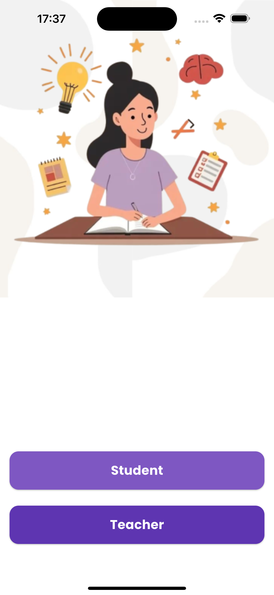
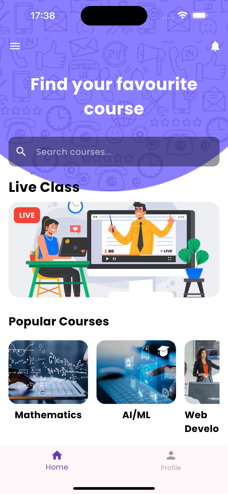
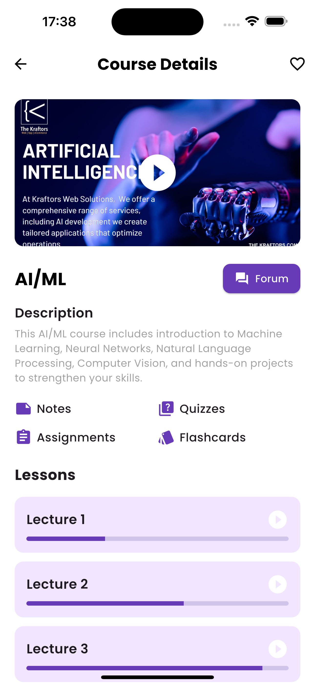
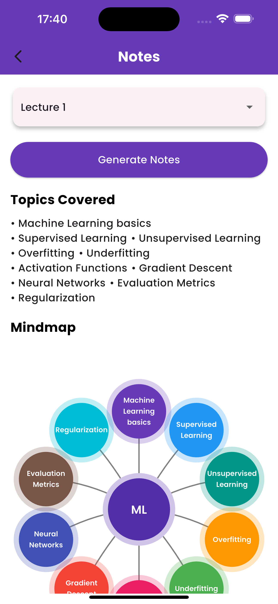
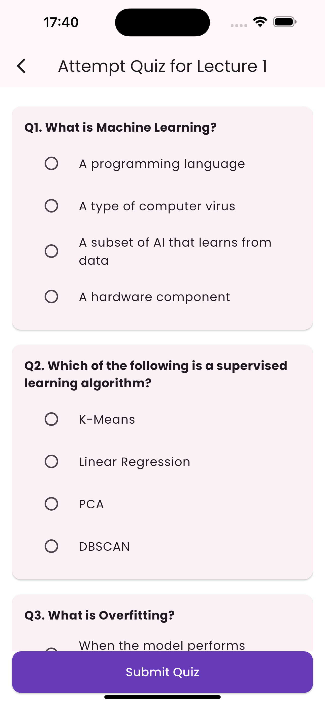
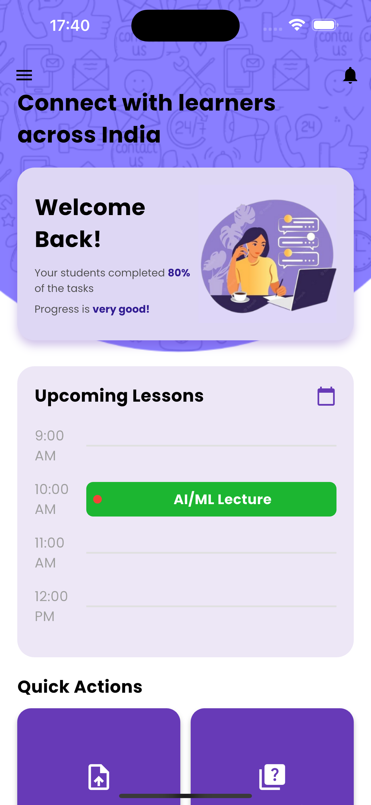

# Paathshaala 
  Paathshaala is an AI-powered, low-bandwidth virtual classroom platform built specifically for rural diploma colleges and underserved communities in India. Unlike traditional online platforms that demand high-speed internet and advanced devices, Paathshaala is optimized for:
  
- Weak and fluctuating networks
- Entry-level smartphones
- Multilingual learners
  
This ensures education continues seamlessly even in the harshest conditions.
  
# Abstract

Paathshaala is designed for **low-bandwidth environments** where conventional video streaming often fails. Its core strength lies in **peer-to-peer (P2P) bandwidth sharing**:

- Students on the **same local network pool their bandwidth** by sharing video chunks with each other.
- This reduces the load on central servers and cuts overall data consumption by up to 70%.
- Even when one student struggles with poor connectivity, they benefit from the stronger connections of peers on the network.
- To ensure reliable delivery across all conditions, Paathshaala adds:
  - **Smart fallback mechanism**:- if bandwidth drops below certain bandwidth, the system switches to audio-only with slides + annotations, ensuring no interruption in learning.
  - **Layered video streaming (DCVC + SVC)**:- a baseline layer (audio + minimal video) is always delivered, with optional enhancement layers for students who have the bandwidth.

This community-first approach to streaming makes Paathshaala especially powerful for rural campuses, where connectivity is weak but students often share the same local networks.

# Key Features
### Connectivity Resilience

- Neural Video Compression (DCVC) + Scalable Video Coding (SVC)
- P2P file chunking for reduced server load
- Adaptive streaming with fallback to audio + slides

### AI-Powered Learning

- Real-time transcription + multilingual translation (MoonShine + IndicTrans2)
- AI-generated notes, mind maps, and quizzes for revision + teaching aid
- Whiteboard detection (YOLOv11) → converts board content into lightweight SVG graphics, preserving clarity at minimal cost

### For Students

- Download/stream lectures in resilient modes
- Access transcriptions, translations & flashcards
- Attempt quizzes & AI-generated assignments
- Collaborate via forums and live classes

### For Teachers

- Upload lectures (pre-recorded or live)
- Auto-generate notes, quizzes, flashcards
- Conduct live classes & manage student doubts
- Stream optimized whiteboard content

# App Flow
1. **Login** as Teacher or Student
2. **Student Dashboard** → explore courses, join live classes, access lectures, notes, quizzes, flashcards
3. **Teacher Dashboard** → schedule/upload lectures, create quizzes, respond to forum doubts
4. **Streaming Engine** ensures resilient delivery based on real-time bandwidth

# User Interface 

  
  
  

  
  
  

